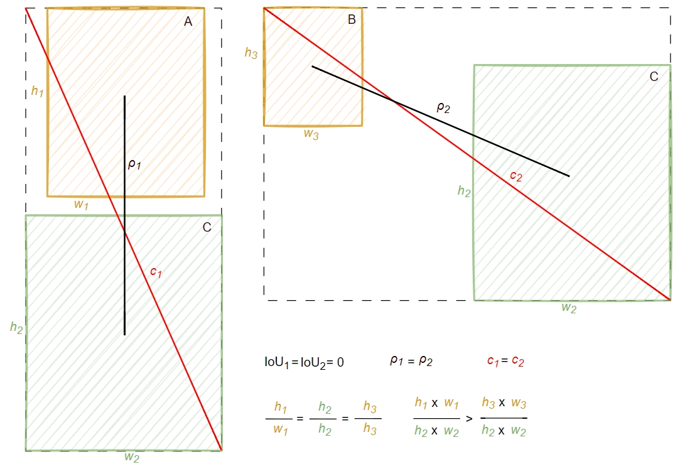

## 0.We created YOLOFLY for implementing object detection in drone aerial photography. YOLOFLY has achieved better performance on the public dataset VisDrone. Details can be found in future publications.

## 1.This is the overall architecture of YOLOFLY.

## 2.To achieve higher real-time detection performance, we have designed a new feature extraction module, C4f, and a lightweight detection head, DWcDetect.

 &nbsp;&nbsp;&nbsp;&nbsp;&nbsp;&nbsp;&nbsp;&nbsp;&nbsp;&nbsp;&nbsp;&nbsp;&nbsp;&nbsp;&nbsp;&nbsp;

## 3.To achieve higher detection accuracy, we have developed a multi-level attention mechanism, MPSA, and a more comprehensive loss function, ACIoU.

 &nbsp;&nbsp;&nbsp;&nbsp;&nbsp;&nbsp;&nbsp;&nbsp;&nbsp;&nbsp;&nbsp;&nbsp;&nbsp;&nbsp;&nbsp;&nbsp;

## 4.Below are our detection results on the public dataset VisDrone.

&nbsp;&nbsp;&nbsp;&nbsp;&nbsp;&nbsp;&nbsp;&nbsp;&nbsp;&nbsp;&nbsp;&nbsp;&nbsp;&nbsp;&nbsp;&nbsp;

## 5.These are the actual test results conducted in the southern Yunnan tourist area.

&nbsp;&nbsp;&nbsp;&nbsp;&nbsp;&nbsp;&nbsp;&nbsp;&nbsp;&nbsp;&nbsp;

